# Conectividad en IoT — Red de monitoreo hídrico de Sabana Centro

**Actividad de refuerzo 2.3** · Internet de las Cosas
Equipo: Santiago Barrera · Tomás Ariza · Andrés Beltrán

---

## Contenido

1. [Del Challenge a la red](#1-del-challenge-a-la-red)
2. [Diseño de la red](#2-diseño-de-la-red)
3. [Protocolos](#3-protocolos)
4. [Ecosistema IoT](#4-ecosistema-iot)
5. [Validación en Packet Tracer](#5-validación-en-packet-tracer)
6. [Troubleshooting](#6-troubleshooting)
7. [Limitaciones del modelo](#7-limitaciones-del-modelo)
8. [Referencias](#8-referencias)

---

## 1. Del Challenge a la red

El Challenge entrega **un nodo**: una estación flotante que mide nivel, caudal, temperatura, humedad, presión, radiación y evaporación potencial en un punto, con tablero local en la WLAN y sin broker.

Esta actividad lo extiende a **una red de nodos** repartidos en los puntos críticos de la región: embalses del Neusa, Sisga y Tominé, plantas de tratamiento municipales, tanques de almacenamiento y estaciones sobre el río Bogotá.

Ese salto cambia el problema. Con un nodo, el dato importa por sí mismo. Con veinte nodos, lo que importa es **la comparación entre ellos**: si el nivel cae en tres puntos a la vez es sequía regional; si cae en uno solo es fuga o falla de sensor. Esa correlación es imposible sin una capa de conectividad que lleve todo a un mismo lugar, y es la razón de fondo por la que aquí sí aparece un broker.

### Por qué el Challenge no usa MQTT y esta red sí

Un broker exige una máquina encendida permanentemente: es costo, consumo y un punto único de falla. Para un dispositivo autónomo que debe seguir midiendo y alarmando aunque se caiga la red, esa dependencia es un defecto de diseño.

En una red de veinte nodos con varios consumidores distintos, esa misma máquina deja de ser un lastre y pasa a ser lo que hace la red posible. **La decisión correcta depende de la escala**, y las dos versiones del proyecto lo demuestran.

---

## 2. Diseño de la red

### 2.1 Las tres escalas del sistema

| Escala | Dónde | Tecnología | Alcance |
|---|---|---|---|
| **PAN** | Dentro del nodo: sensores al microcontrolador | I²C, 1-Wire, GPIO | centímetros |
| **WLAN** | Nodos en sitios con energía e infraestructura | Wi-Fi 802.11 b/g/n 2,4 GHz | 50–100 m |
| **LPWAN** | Nodos remotos sin energía ni cobertura | LoRaWAN 915 MHz (ISM en Colombia) | 5–15 km rurales |

La red es **heterogénea a propósito**. Un embalse no tiene wifi y una planta de tratamiento no necesita LoRa. Imponer una sola tecnología encarecería unos puntos y dejaría a otros sin cobertura.

### 2.2 Por qué LoRaWAN en los nodos remotos

El volumen de datos decide la tecnología:

```
7 variables × 4 bytes             = 28 bytes
+ identificador y marca de tiempo = 12 bytes
Total por muestra                 ≈ 40 bytes
Una muestra cada 15 min           = 96 muestras/día
Tráfico por nodo                  ≈ 3,8 KB/día
```

Menos de cuatro kilobytes diarios. Contra ese número:

- **Wi-Fi** daría mil veces más ancho de banda del necesario, a cambio de consumo alto y 100 m de alcance. Incorrecto para un embalse.
- **Celular 4G** resuelve cobertura pero exige plan de datos por nodo y consume demasiado para alimentación solar pequeña.
- **NB-IoT / LTE-M** son la alternativa seria: bajo consumo y cobertura del operador. Se descartan por costo de SIM por nodo y porque la cobertura en zonas de embalse no está garantizada.
- **LoRaWAN** entrega decenas de bytes a kilómetros con consumo de microamperios en reposo, sobre infraestructura propia y sin costo recurrente por nodo.

La decisión no es "LoRa es mejor", sino que **el perfil de tráfico es de pocos bytes muy espaciados**, y esa es la forma que LPWAN está diseñada para transportar.

### 2.3 Por qué hay gateway

El gateway cumple cuatro funciones que ningún nodo puede asumir:

1. **Traducción de protocolo.** LoRaWAN no habla TCP/IP. Alguien convierte la trama de radio en publicación MQTT.
2. **Agregación.** Un enlace a Internet sirve a todos los nodos de su zona.
3. **Almacenamiento temporal.** Si el enlace cae, guarda en búfer y reenvía al restablecerse.
4. **Frontera de seguridad.** Los nodos nunca se exponen a Internet; solo el gateway tiene credenciales de plataforma.

Se implementa sobre un SBC con concentrador LoRa, y sale a Internet por Ethernet o 4G.

> **Nota de diseño:** se instala un gateway por sede que lo justifique, no uno por punto de monitoreo. La sede de Cogua, con un solo nodo, no lleva concentrador dedicado.

---

## 3. Protocolos

### 3.1 Pila completa

| Capa | Nodo remoto | Nodo urbano | Gateway → nube | Usuario |
|---|---|---|---|---|
| Aplicación | LoRaWAN app | MQTT | MQTT v3.1.1 | HTTPS |
| Seguridad | AES-128 | TLS | TLS 1.2+ (8883) | TLS |
| Transporte | LoRaWAN MAC | TCP | TCP | TCP |
| Red | — | IPv4 | IPv4 | IPv4 |
| Enlace / físico | LoRa 915 MHz | 802.11 b/g/n | Ethernet / 4G | — |

### 3.2 Por qué MQTT

**Frente a HTTP.** Una petición HTTP arrastra cabeceras de cientos de bytes para entregar cuarenta útiles, y abre y cierra conexión cada vez. MQTT mantiene conexión persistente y su cabecera fija es de **dos bytes**. Con payload de 40 bytes, esa diferencia es el 80 % del tráfico.

**Frente a CoAP.** CoAP es igual de liviano y sobre UDP, pero sigue el modelo petición-respuesta y no desacopla productores de consumidores.

**Y sobre todo, por el desacoplamiento.** El nodo no sabe quién lee sus datos: publica en un tópico. Mañana se agrega un tablero nuevo, o la autoridad ambiental pide un canal propio, y **no hay que tocar un solo nodo en campo**.

### 3.3 Las cuatro características que hacen el diseño

- **Tópicos jerárquicos** con comodines para suscripción selectiva.
- **QoS** en tres niveles: 0 sin confirmación, 1 al menos una entrega, 2 exactamente una.
- **Retained:** el broker conserva el último mensaje y lo entrega a quien se suscriba después. Sin esto, un tablero recién abierto queda en blanco.
- **Last Will and Testament:** el nodo declara al conectarse un mensaje que el broker publicará **si el nodo se cae**. Sin LWT, un nodo apagado simplemente deja de publicar y nadie se entera.

### 3.4 Esquema de tópicos

```
sabana/{municipio}/{punto}/{nodo}/{variable}
```

```
sabana/cogua/neusa/nodo01/nivel
sabana/cogua/neusa/nodo01/evaporacion
sabana/cogua/neusa/nodo01/estado           ← retained + LWT
sabana/chia/planta-norte/nodo02/nivel
sabana/chia/planta-norte/nodo02/cmd/umbral ← downlink
```

| Filtro | Devuelve |
|---|---|
| `sabana/cogua/neusa/nodo01/#` | Todo lo de un nodo |
| `sabana/+/+/+/nivel` | El nivel de todos los nodos de la región |
| `sabana/chia/#` | Todo lo de un municipio |
| `sabana/+/+/+/estado` | El estado de salud de la red completa |

### 3.5 QoS y retención por tipo de mensaje

| Tópico | QoS | Retained | Razón |
|---|---|---|---|
| Telemetría | 0 | Sí | Si se pierde uno, el siguiente llega en 15 min |
| Alertas | 1 | Sí | Perder una alerta es inaceptable |
| Comandos | 1 | No | Debe llegar, pero no reejecutarse al reconectar |
| Estado / LWT | 1 | Sí | Quien se suscriba debe saber de inmediato si el nodo vive |

**Payload:** JSON compacto en los tramos IP; CBOR o binario en el tramo LoRa.

```json
{"n":18.4,"T":13.2,"h":78,"p":751.3,"e":3.1,"ts":1727280000}
```

### 3.6 Seguridad

- **Tramo LoRa:** AES-128 nativo de LoRaWAN, claves de red y de aplicación distintas por dispositivo.
- **Tramo MQTT:** TLS en el puerto 8883. Nunca 1883 en claro fuera de la red local.
- **Autenticación:** credencial única por nodo. Si uno se compromete, se revoca solo ese.
- **ACL por tópico:** cada nodo publica únicamente bajo su rama y se suscribe solo a sus comandos.

---

## 4. Ecosistema IoT

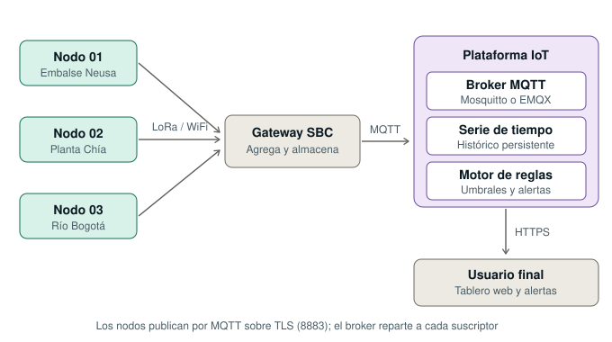

### 4.1 Dispositivos

Nodos con ESP32, sensores de nivel y caudal más las variables meteorológicas. Cada uno conserva la inteligencia del Challenge: valida sus lecturas, aplica la lógica de fusión, decide localmente si hay alarma y acciona su zumbador y su LCD. **La red mejora el sistema; no lo sostiene.**

### 4.2 Gateway

SBC con concentrador LoRa. Recibe las tramas de radio, las traduce a publicaciones MQTT, mantiene búfer cuando el enlace cae y actúa como frontera de seguridad.

### 4.3 Plataforma IoT

Tres piezas que conviene no confundir:

- **Broker MQTT.** Solo transporta. No almacena más allá del último retenido y no dibuja nada.
- **Base de series de tiempo.** Un suscriptor que escribe todo lo que llega. Aquí vive el histórico.
- **Motor de reglas y tablero.** Otro suscriptor que evalúa umbrales regionales y sirve la interfaz.

> **MQTT no da tablero ni histórico.** Es un transporte. Todo lo demás son suscriptores construidos encima.

### 4.4 Conectividad a Internet

Del gateway a la plataforma: Ethernet o fibra donde hay infraestructura, 4G donde no. MQTT sobre TLS, puerto 8883, conexión saliente — no hace falta abrir puertos entrantes ni IP pública en el gateway.

### 4.5 Usuario final

Navegador contra el tablero por HTTPS y notificaciones al celular del operador. El operador municipal ve sus puntos; la autoridad ambiental ve la región completa.

---

## 5. Validación en Packet Tracer

### 5.1 Topología implementada

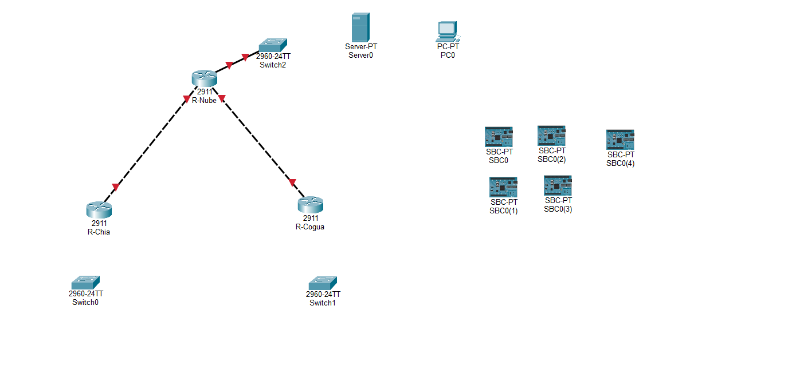

```
   SEDE CHÍA  192.168.10.0/24              NUBE  200.1.1.0/24
   ┌──────────────────────┐                ┌──────────────────────┐
   │ Nodo-Chia-01         │                │ SBC-Broker     .10   │
   │ Nodo-Chia-02         │                │ Server-Plataforma .20│
   │ SBC-Gateway-Chia     │                │ PC-Operador    .30   │
   └────────┬─────────────┘                └──────────┬───────────┘
         Switch-Chia                            Switch-Nube
            │                                        │
       R-Chia g0/0                             R-Nube g0/2
            │ g0/1 ──── 10.0.0.0/30 ──── g0/0 │
                                               │ g0/1
   SEDE COGUA  192.168.20.0/24                 │
   ┌──────────────────────┐                    │
   │ Nodo-Neusa-01        │                    │
   └────────┬─────────────┘                    │
         Switch-Cogua                          │
            │                                  │
       R-Cogua g0/0                            │
            │ g0/1 ──── 10.0.0.4/30 ───────────┘
```

### 5.2 Plan de direccionamiento

| Dispositivo | Interfaz | Dirección | Máscara | Gateway |
|---|---|---|---|---|
| R-Chia | g0/0 | 192.168.10.1 | /24 | — |
| R-Chia | g0/1 | 10.0.0.1 | /30 | — |
| R-Cogua | g0/0 | 192.168.20.1 | /24 | — |
| R-Cogua | g0/1 | 10.0.0.5 | /30 | — |
| R-Nube | g0/0 | 10.0.0.2 | /30 | — |
| R-Nube | g0/1 | 10.0.0.6 | /30 | — |
| R-Nube | g0/2 | 200.1.1.1 | /24 | — |
| SBC-Broker | Fa0 | 200.1.1.10 | /24 | 200.1.1.1 |
| Server-Plataforma | Fa0 | 200.1.1.20 | /24 | 200.1.1.1 |
| PC-Operador | Fa0 | 200.1.1.30 | /24 | 200.1.1.1 |
| Nodos de sede | Fa0 | DHCP | — | — |

Los nodos por DHCP a propósito: en campo nadie configura veinte dispositivos a mano. Los servicios de la nube van fijos porque si al broker le cambia la dirección, ningún cliente lo encuentra.

### 5.3 Configuración de los routers

<details>
<summary><b>R-Chia</b></summary>

```
enable
configure terminal
hostname R-Chia

interface gigabitEthernet 0/0
 ip address 192.168.10.1 255.255.255.0
 no shutdown
 exit

interface gigabitEthernet 0/1
 ip address 10.0.0.1 255.255.255.252
 no shutdown
 exit

ip dhcp excluded-address 192.168.10.1 192.168.10.20
ip dhcp pool LAN-CHIA
 network 192.168.10.0 255.255.255.0
 default-router 192.168.10.1
 dns-server 200.1.1.20
 exit

ip route 200.1.1.0 255.255.255.0 10.0.0.2
ip route 192.168.20.0 255.255.255.0 10.0.0.2
end
write memory
```
</details>

<details>
<summary><b>R-Cogua</b></summary>

```
enable
configure terminal
hostname R-Cogua

interface gigabitEthernet 0/0
 ip address 192.168.20.1 255.255.255.0
 no shutdown
 exit

interface gigabitEthernet 0/1
 ip address 10.0.0.5 255.255.255.252
 no shutdown
 exit

ip dhcp excluded-address 192.168.20.1 192.168.20.20
ip dhcp pool LAN-COGUA
 network 192.168.20.0 255.255.255.0
 default-router 192.168.20.1
 dns-server 200.1.1.20
 exit

ip route 200.1.1.0 255.255.255.0 10.0.0.6
ip route 192.168.10.0 255.255.255.0 10.0.0.6
end
write memory
```
</details>

<details>
<summary><b>R-Nube</b></summary>

```
enable
configure terminal
hostname R-Nube

interface gigabitEthernet 0/0
 ip address 10.0.0.2 255.255.255.252
 no shutdown
 exit

interface gigabitEthernet 0/1
 ip address 10.0.0.6 255.255.255.252
 no shutdown
 exit

interface gigabitEthernet 0/2
 ip address 200.1.1.1 255.255.255.0
 no shutdown
 exit

ip route 192.168.10.0 255.255.255.0 10.0.0.1
ip route 192.168.20.0 255.255.255.0 10.0.0.5
end
write memory
```
</details>

Verificación de la tabla de enrutamiento en R-Nube:

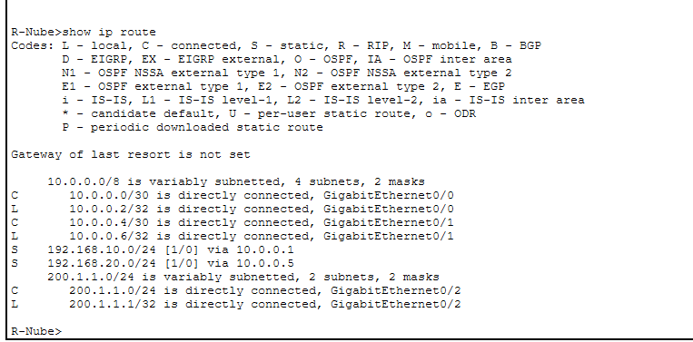

Las dos rutas estáticas (`S`) hacia las sedes y las tres redes conectadas (`C`) confirman que la capa 3 está completa.

### 5.4 Instalación del broker MQTT

El SBC-PT no trae *User Apps Manager* en su escritorio:

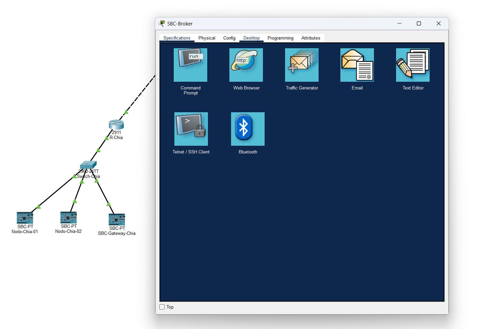

La ruta correcta es la pestaña **Programming → New → Global Script Project → MQTT Broker (Python) → Create → Install to Desktop**:

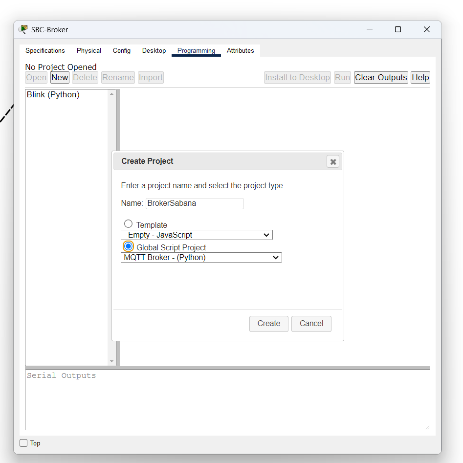

Tras reabrir el dispositivo, la aplicación aparece en el escritorio y se activa con el servicio en **On**:

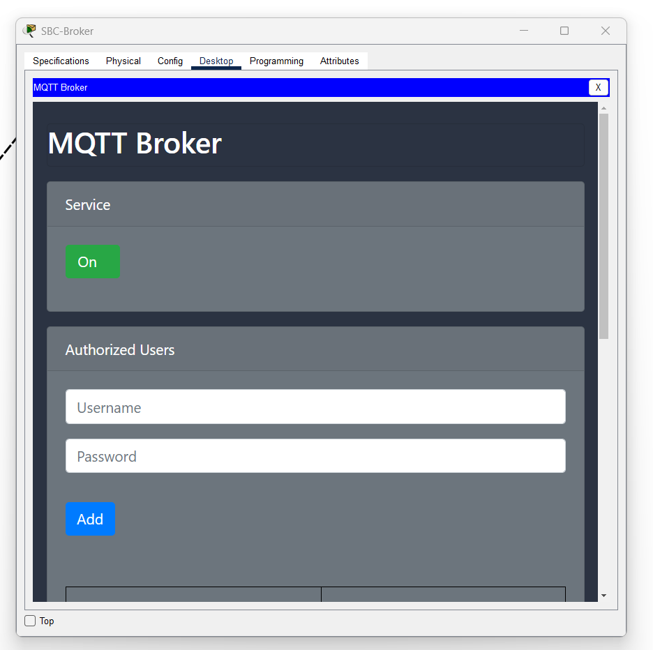

### 5.5 Autenticación por nodo

Se implementó la credencial única por dispositivo que describe el diseño, usando la sección *Authorized Users* del broker:

| Username | Password |
|---|---|
| `nodo-chia-01` | `sabana01` |
| `nodo-chia-02` | `sabana02` |
| `nodo-neusa-03` | `sabana03` |
| `operador` | `sabana2026` |

### 5.6 Conexión de los clientes

Cada nodo ejecuta **MQTT Client** apuntando a `200.1.1.10:1883` con su credencial propia:

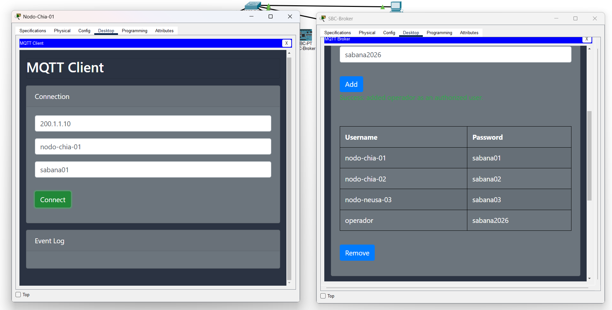

### 5.7 Publicación y suscripción con comodines

**Publicadores:**

| Nodo | Tópico | Mensaje |
|---|---|---|
| Nodo-Chia-01 | `sabana/chia/planta-norte/nodo01/nivel` | `{"n":18.4,"T":13.2,"h":78,"p":751.3}` |
| Nodo-Chia-02 | `sabana/chia/planta-norte/nodo02/nivel` | `{"n":16.1,"T":13.5,"h":75,"p":751.0}` |
| Nodo-Neusa-01 | `sabana/cogua/neusa/nodo03/nivel` | `{"n":7.9,"T":11.0,"h":86,"p":748.1}` |

**Suscriptor (PC-Operador):** `sabana/+/+/+/nivel`

Con una sola suscripción, el operador recibe los tres nodos, que están en **dos sedes distintas, dos subredes distintas y separadas por dos routers**. Ese es el desacoplamiento de MQTT hecho visible: agregar un nodo nuevo no exige cambiar nada en el consumidor.

---

## 6. Troubleshooting

Durante la implementación se documentaron **seis incidentes reales**. Cada uno con síntoma, diagnóstico y solución.

### Caso 1 · El router entra al diálogo de configuración inicial

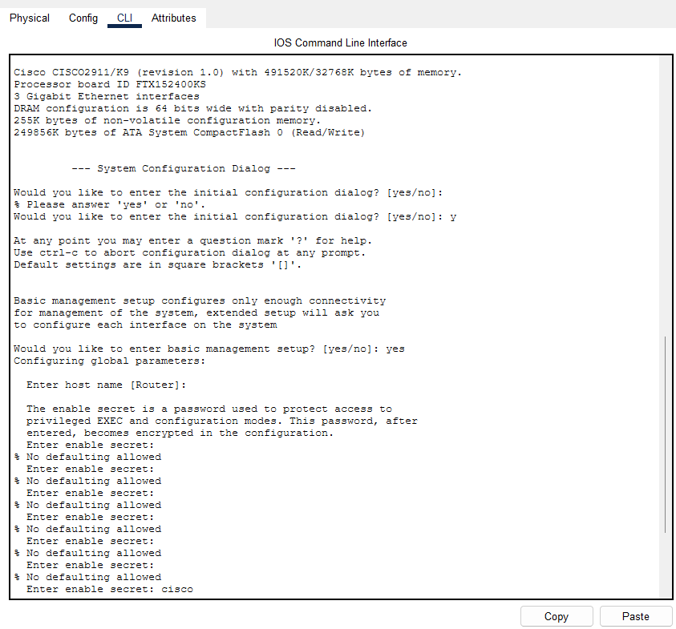

**Síntoma.** Al abrir el CLI, el router pregunta por el asistente de configuración y queda atrapado pidiendo `enable secret` repetidamente.

**Diagnóstico.** Se respondió `yes` al `System Configuration Dialog`. Ese asistente deja el equipo parcialmente configurado con parámetros que después estorban.

**Solución.** `Ctrl + C` para abortar. Para partir limpio: `erase startup-config` seguido de `reload`, y responder `no` al diálogo.

**Aprendizaje.** El asistente no ahorra trabajo en una topología con enrutamiento estático; es más rápido y predecible configurar por CLI.

---

### Caso 2 · Cable en rojo entre SBC y switch

**Síntoma.** Al conectar un SBC-PT al switch, el enlace queda rojo sin mensaje de error.

**Diagnóstico.** El SBC-PT **se coloca sin tarjeta de red**. No tiene puerto físico donde conectar.

**Solución.** Pestaña **I/O Config** → *Network Adapter* → **PT-BOARD-NM-1CFE**. Aparece `FastEthernet0` y el enlace se pone verde.

**Aprendizaje.** Los dispositivos de la categoría *Boards* son modulares por diseño; a diferencia de un PC-PT, no traen conectividad de fábrica.

---

### Caso 3 · El nodo no recibe dirección por DHCP

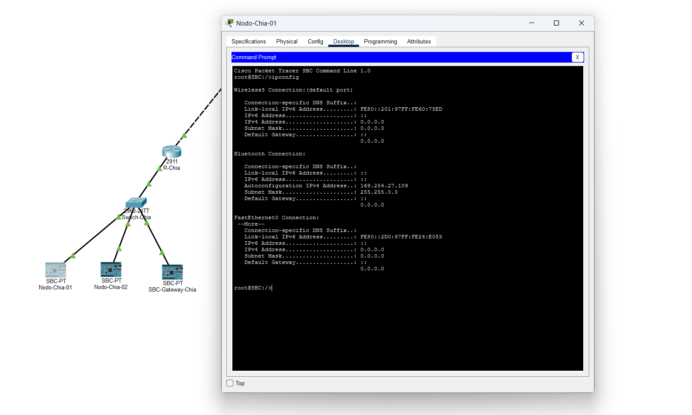

**Síntoma.** `ipconfig` en Nodo-Chia-01 devuelve `0.0.0.0` en `FastEthernet0`, pese a que el pool DHCP estaba configurado y el enlace verde.

**Diagnóstico.** La interfaz estaba en modo **Static** con todo en ceros. El DHCP del router funcionaba, pero el cliente nunca lo solicitó. Se observa además que el SBC reporta `Wireless3 Connection: (default port)`.

**Solución.** Pestaña **Config → FastEthernet0 → DHCP**. La dirección se asigna en segundos.

**Aprendizaje.** Un pool DHCP correctamente configurado no sirve de nada si el cliente está en modo estático. Verificar siempre los dos extremos.

---

### Caso 4 · Se instaló el broker en un nodo por error

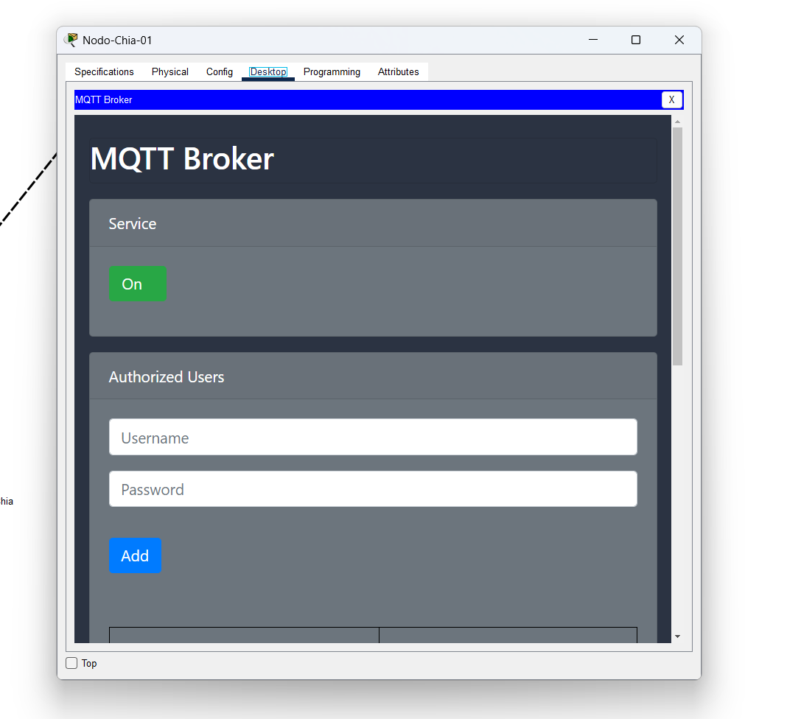

**Síntoma.** Nodo-Chia-01 muestra la interfaz de *MQTT Broker* con la sección *Authorized Users*, en lugar de la de cliente.

**Diagnóstico.** En el cuadro *Create Project*, el desplegable conserva la última plantilla usada. Al crear el proyecto del nodo quedó seleccionado **MQTT Broker** en vez de **MQTT Client**.

**Solución.** Pestaña *Programming* → seleccionar el proyecto → **Delete** → crear uno nuevo verificando que el desplegable diga **MQTT Client - (Python)** → *Install to Desktop*.

**Aprendizaje.** Un nodo con broker instalado no falla ruidosamente: simplemente nunca publica. Los errores de configuración silenciosos son los más costosos de detectar.

---

### Caso 5 · `ping` falla pero `tracert` y MQTT funcionan

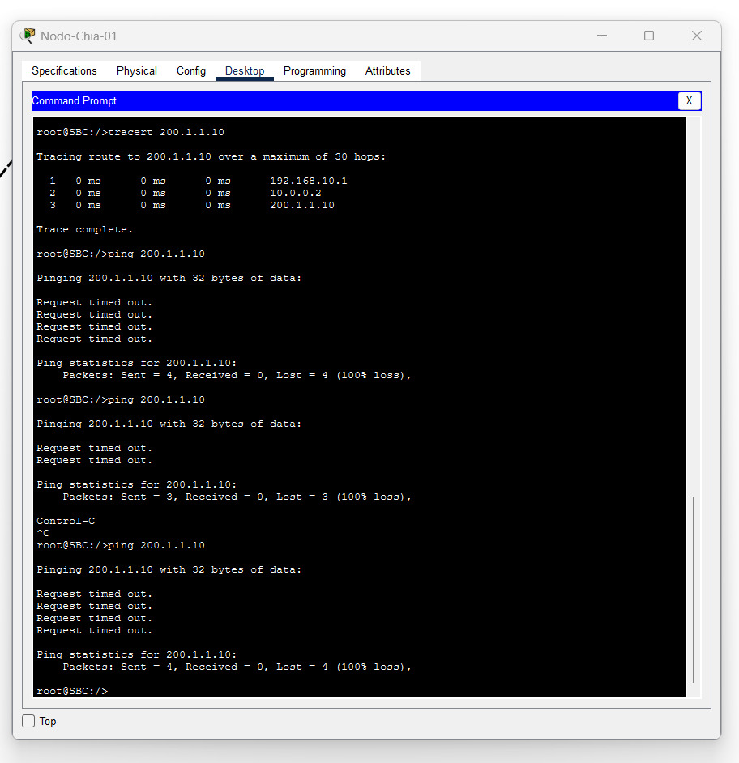

**Síntoma.** Desde Nodo-Chia-01, `ping 200.1.1.10` devuelve 100 % de pérdida. Sin embargo, `tracert 200.1.1.10` completa los tres saltos correctamente y el cliente MQTT logra conectarse al broker.

**Diagnóstico.** Este fue el caso más instructivo. La prueba diferenciada acotó el problema:

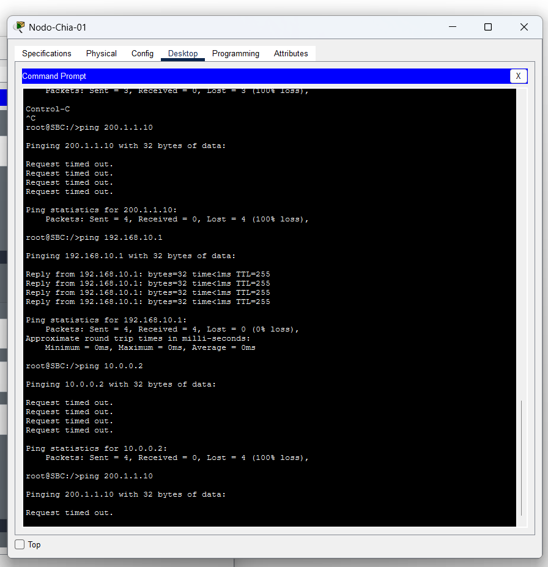

| Destino | Resultado | Interpretación |
|---|---|---|
| `192.168.10.1` | Responde | Misma subred: resuelve por ARP directo |
| `10.0.0.2` | Sin respuesta | Fuera de la subred: requiere puerta de enlace |
| `200.1.1.10` | Sin respuesta | Fuera de la subred |

Se verificó `show ip route` en R-Nube y las rutas estáticas estaban correctas, lo que descartó el enrutamiento. El problema estaba en el nodo: la configuración de interfaz no había aplicado la puerta de enlace para el tráfico saliente de la subred.

**Solución.** Confirmar el modo **DHCP** en la interfaz del nodo, lo que asigna dirección, máscara y puerta de enlace de forma coherente.

**Aprendizaje.** "No responde el ping" no equivale a "no hay conectividad". ICMP, la resolución de ruta de `tracert` y una sesión TCP pueden comportarse distinto en un dispositivo con varias interfaces. La prueba por escalones —misma subred, siguiente salto, destino final— localiza el problema mucho más rápido que repetir el mismo ping.

---

### Caso 6 · Comodín MQTT que no coincide

**Síntoma.** El suscriptor no recibe mensajes pese a que los publicadores están conectados y el tópico parece correcto.

**Diagnóstico.** Se usó el filtro `sabana/+/nivel` esperando que capturara `sabana/chia/planta-norte/nodo01/nivel`.

**Solución.** El comodín `+` sustituye **exactamente un nivel** de la jerarquía, no varios. El filtro correcto es `sabana/+/+/+/nivel`, o bien `sabana/#` para capturar todo.

**Aprendizaje.** La diferencia entre `+` y `#` es la fuente de error más común al diseñar esquemas de tópicos, y no produce ningún mensaje de error: simplemente no llega nada.

---

## 7. Limitaciones del modelo

Ningún simulador reproduce todo. Declarar qué quedó fuera es parte del rigor del trabajo.

**1. LoRaWAN no se simula.** Packet Tracer no implementa LPWAN. En el laboratorio los nodos remotos aparecen conectados por Ethernet; en el sistema real hablarían LoRa hasta el gateway, sin pila TCP/IP propia.

**2. El gateway no traduce.** Como no hay LoRa, el SBC-Gateway aparece en la topología cumpliendo su rol de agregación y frontera de seguridad, pero no ejecuta cliente MQTT: no tiene nada que traducir. En el sistema real sería el **único** dispositivo de la sede que publica al broker.

**3. TLS no se simula.** El broker de Packet Tracer escucha en 1883 sin cifrado. En producción sería 8883 sobre TLS. La autenticación por credencial única sí se implementó y se validó.

**4. El volumen de tráfico no es representativo.** La simulación envía mensajes bajo demanda; el sistema real publicaría cada 15 minutos por nodo.

---

## 8. Referencias

- OASIS. *MQTT Version 3.1.1* y *MQTT Version 5.0* — especificación del protocolo.
- LoRa Alliance. *LoRaWAN Regional Parameters* — banda AU915/US915 aplicable a Colombia.
- Cisco Networking Academy. *Introduction to IoT* y laboratorios de IoT en Packet Tracer.
- Eclipse Mosquitto. Documentación sobre ACL, TLS y mensajes retenidos.
- ANE / MinTIC. Cuadro Nacional de Atribución de Bandas de Frecuencia (bandas ISM en Colombia).
- IDEAM. Red hidrometeorológica nacional.

> Completar con las fuentes efectivamente consultadas por el equipo antes de la entrega.
